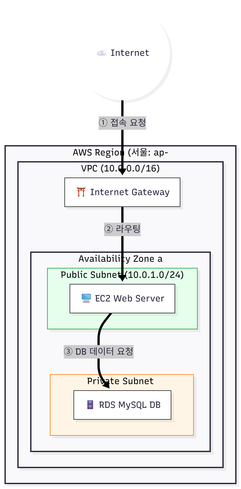

# 🚀 Project 1. "맨땅에 헤딩" 개발 일지

AWS 콘솔과 리눅스 터미널만을 사용하여 3-Tier 아키텍처를 직접 구축하는 과정을 기록합니다.

  

## 📅 2026.01.16 (금) - 네트워크 기초 공사 완료

### 1. 주요 작업 (Work Done)
- **VPC 및 서브넷 구축:**
  - VPC (`10.0.0.0/16`) 생성 완료.
  - Public Subnet (`10.0.1.0/24`) 및 Private Subnet (`10.0.2.0/24`)으로 망 분리 적용.
- **인터넷 연결:** 인터넷 게이트웨이(IGW) 생성 및 VPC 연결.
- **라우팅 테이블 설정:** Public Subnet이 IGW를 타고 나가도록 라우팅 경로 설정.

### 2. 트러블 슈팅 (Troubleshooting)
**이슈: 라우팅 테이블 수정 시 Local 경로 에러**
- **문제:** 인터넷 연결을 위해 `0.0.0.0/0`을 추가하려다, 실수로 기존 `local` 경로를 덮어쓰려 함.
- **원인:** `local` 경로는 VPC 내부 통신을 위한 필수 경로라 수정/삭제가 불가능함.
- **해결:** [라우팅 추가] 버튼을 눌러 새로운 줄에 IGW 경로를 별도로 추가하여 해결.
- **교훈:** AWS VPC의 기본 라우팅(`local`)은 건드리지 말고, 외부 경로는 항상 '추가'해야 함을 배움.

---

---

## 📅 2026.01.17 (토) - 웹 서버(EC2) & 데이터베이스(RDS) 구축

### 1. 주요 작업 (Work Done)
- **웹 서버(EC2) 배포:**
  - Public Subnet에 `Amazon Linux 2023` (t3.micro) 인스턴스 생성.
  - 보안 그룹(`my-web-sg`)에서 HTTP(80), SSH(22) 포트 개방.
  - Nginx 웹 서버 설치 및 접속 테스트 완료 (`Welcome to nginx!`).
- **데이터베이스(RDS) 구축:**
  - Private Subnet에 `MySQL` (t3.micro) 인스턴스 생성.
  - **보안 설정(핵심):** RDS 보안 그룹(`my-db-sg`) 인바운드 규칙에 **"Web Server 보안 그룹 ID"** 만 등록하여 오직 웹 서버만 DB에 접근 가능하도록 제한.
- **연동 테스트:**
  - EC2 내부에서 `mariadb105` 클라이언트 설치.
  - `mysql -h [엔드포인트] -u admin -p` 명령어로 접속 성공.
  - `SHOW DATABASES;` 명령어로 `mydb` 생성 확인.

### 2. 배운 점 (Key Takeaways)
- **보안 그룹 체이닝(Chaining):** IP 주소가 아니라 **"보안 그룹 ID"**를 소스로 지정하면, 해당 그룹에 속한 서버들만 안전하게 접속을 허용할 수 있다는 것을 배움.
- **RDS와 Subnet:** DB는 외부에서 직접 접근할 수 없도록 반드시 **Private Subnet**에 배치해야 함.

---
## 📅 2026.01.18 (일) - 프로젝트 완수 (Mission Complete)

### 1. 주요 작업 (Final Integration)
- **웹 어플리케이션 배포:**
  - `Apache(httpd)` 웹 서버 및 `PHP` 설치.
  - `php-mysqlnd` 라이브러리를 통해 EC2와 RDS 간 통신 환경 구축.
- **최종 연동 테스트:**
  - `mysqli` 객체를 사용하여 RDS 엔드포인트로 접속 시도.
  - 웹 브라우저를 통해 **"Connected to: mydb"** 성공 메시지 확인.

### 🏆 프로젝트 회고 (Retrospective)
- **성과:** AWS 마법사 없이 VPC, Subnet, Route Table, IGW, EC2, RDS, Security Group 등 모든 리소스를 **수동으로 직접 설계하고 구축**함.
- **배운 점:**
  - **3-Tier Architecture:** 보안을 위해 DB를 Private Subnet에 숨기고, 오직 웹 서버를 통해서만 접근하게 하는 구조를 완벽히 이해함.
  - **Troubleshooting:** 라우팅 테이블 설정 실수, 보안 그룹 연결 등 다양한 문제를 직접 해결하며 디버깅 능력을 키움.
    

